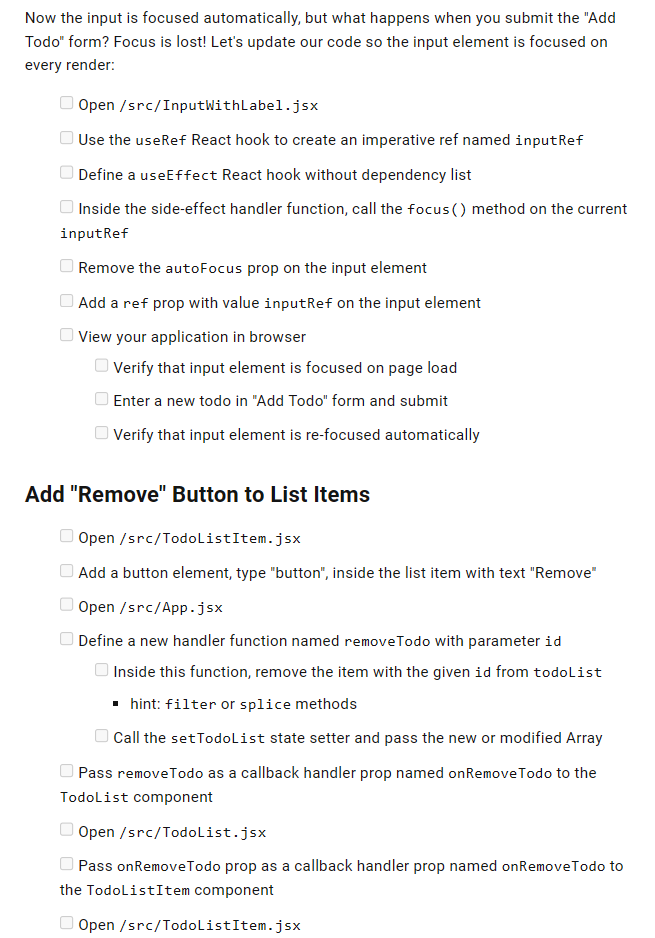

# All about this project 

#  ------------ (Step by Setp) Lesson 1-2 ------------

# Commit project and create working branch
  1. Commit the installed project
  2. Push changes to GitHub repo
  3. Create and checkout a working branch with the name of lesson_1_1
  4. Publish that branch to GitHub and start coding!

# Create the beginnings of the todo list

## React Components and JSX
  1. Open the src/App.jsx file
  2. Remove the existing JSX from the component
  3. Create a level-one heading that says "Todo List"
  4. Create an unordered list (ul)

## Lists in React
  1. Above the App() function, create an empty Array and store it in a variable named todoList
  2. Inside the Array, create at least 3 Objects with the following properties:
      id: unique identifier (ex. 1, 2, 3)
      title: summary of the todo item (ex. "Complete assignment")
  3. Inside your unordered list, insert a JavaScript expression
      hint: {}
  4. Inside the JavaScript expression, map over your todoList array
  5. For each Object in the Array, return a list item (li) with the following:
      key attribute with value of id property
      inner text content with value of title property

#  ------------ (Step by Setp) Lesson 1-3 ------------

# Move List into New "Todo List" Component

# Create "Add Todo Form" Component

#  ------------ (Step by Setp) Lesson 1-4 ------------
#     Coding Assignment
##  This lesson will teach you the following:

    1. Lifting State
    2. Controlled Components
    3. Props handling

# Move Todo List into State

# Control "Add Todo" Input

# Add New Todo to List

# Destructure Props

#  ------------ (Step by Setp) Lesson 1-5 ------------

## Here is the output after completion!

#  ------------ (Step by Setp) Lesson 1-6 ------------

